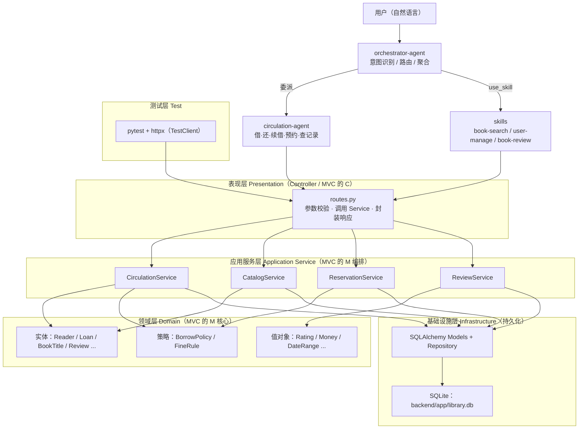

# 架构设计说明书（Architecture Design）

| 项 | 内容 |
|---|---|
| 文档编号 | `07-architecture.md` |
| 版本 | v1.0（实验一 · 步骤10） |
| 状态 | **待人工审查** |
| 生成依据 | `02-requirements.md`、`05-domain-model.md`、`constitution.md` |
| 下游文档 | `08-package-diagram.puml`（包图）、`09-design-model.md`、`13-database-design.md` |

> 架构约束（宪法第 5、6 条）：分层架构 + MVC；依赖只能自上而下；**业务规则不得写在 Controller**。

---

## 1. 架构总览

系统采用**四层分层架构 + MVC**，并在表现层之上增加 **Agent 接入层**（对话入口）：



---

## 2. 分层职责

| 层 | 载体（目标结构） | 职责 | 禁止 |
|---|---|---|---|
| **Agent 接入层** | `.codebuddy/agents/`、`skills/` | 自然语言意图识别、路由分发、调用 REST API、结果聚合 | Agent 不得绕过 API 直接操作数据库 |
| **表现层（Controller）** | `backend/app/routes.py` | 接收请求、Pydantic 参数校验、调用 Service、封装 `{code, message, data}` | **不得写业务规则**；不得直接访问 Repository |
| **应用服务层** | `backend/app/services/` | 用例流程编排、事务边界、权限校验、领域对象装配 | 不得直接写 SQL |
| **领域层** | `backend/app/domain/`（本期落在 `models.py` + `policies/`） | 实体、值对象、策略对象与不变量 | 不得依赖 FastAPI / HTTP |
| **基础设施层** | `backend/app/models.py`、`repositories/` | ORM 映射、会话管理、持久化 | 不得包含业务规则 |
| **测试层** | `tests/` | pytest + httpx 接口集成测试 | — |

> 本期实现说明：基座当前为 `models.py` + `routes.py` 两文件结构。为保证**最小增量修改**（宪法第 13 条），本期不强行拆分目录，而是：
> - 业务规则抽取到 `services/` 或 `policies/` 中新增的模块；
> - `routes.py` 保持"薄 Controller"；
> - 领域实体继续复用 `models.py` 的 ORM 类（SQLAlchemy 类同时承担实体与持久化映射，属教学简化）。

---

## 3. 模块划分

| 模块 | 职责 | 表现层 | 应用服务 | 领域/策略 | 主要需求 |
|---|---|---|---|---|---|
| `reader` | 读者账号与资格 | `/api/users/*`、`/api/login` | `ReaderService` | `Reader`、`BorrowCard` | FR-000、FR-001 |
| `card` | 借阅证办理与注销 | —（仅建模） | `CardService` | `BorrowCard`、`CardNo` | FR-002、FR-003 |
| `catalog` | 图书检索与详情 | `/api/books/*` | `CatalogService` | `BookTitle`、`LibraryItem` | FR-006~FR-010 |
| `circulation` | 借书、还书、**续借** | `POST /api/borrow`、`/api/return`、`/api/renew` | `CirculationService` | `Loan`、`BorrowPolicy` | FR-011、FR-012、**FR-017** |
| `reservation` | 预约排队与失效 | `POST /api/books/reserve` | `ReservationService` | `Reservation` | FR-014 |
| `fine` | 超期罚款计算 | （随归还返回） | `FineService` | `FineRule`、`FineRecord` | FR-015 |
| `review` | 评论与评分 | `/api/reviews/*` | `ReviewService` | `Review`、`Rating` | **FR-018、FR-019** |
| `admin` | 管理员与规则维护 | —（仅建模） | `AdminService` | `BorrowPolicy`、`FineRule` | FR-004~FR-009、FR-016 |

---

## 4. MVC 映射

| MVC 角色 | 本项目落点 |
|---|---|
| **Model（模型）** | 领域层实体 / 值对象 / 策略 + 应用服务层（`Reader`、`Loan`、`BookTitle`、`Review`、`BorrowPolicy`、`FineRule` 及 `CirculationService` 等） |
| **View（视图）** | ① REST 响应体：`{code, message, data}` 统一信封；② 对话入口：Agent 聚合后的自然语言回复 |
| **Controller（控制器）** | `routes.py` 中的 FastAPI 端点；仅做参数校验、调用 Service、封装响应 |

> 关键纪律：**Controller 不得直接依赖 Repository**，只能依赖 Application Service（宪法第 5 条）。

---

## 5. 依赖方向规则

```
表现层 → 应用服务层 → 领域层 →（接口）← 基础设施层
```

- 依赖只能**自上而下**；领域层通过 Repository 接口访问持久化，基础设施层实现该接口（依赖倒置）；
- 领域层**不依赖** FastAPI、HTTP、SQLite；
- 领域层**不依赖**表现层。

---

## 6. 权限控制策略

| 策略 | 说明 |
|---|---|
| 校验位置 | **应用服务层**（Service 方法入口），Controller 不重复实现规则 |
| 角色来源 | 登录后获得 `user_id` 与 `role`（`reader` / `admin`）；第一阶段无 Token，接口显式传 `user_id` |
| 读者 | 仅可访问本人资源（`user_id` 必须等于自身） |
| 图书管理员 | 可代理办理借/还/续借，可查询任意读者借阅信息 |
| 系统管理员 | 维护类操作；**管理员本人不能借书**（BR-003） |
| 越权响应 | `code = 400`，`message` 明确原因（如"管理员不能借书"），不得静默放行 |
| 后续演进 | 引入 Token 后，权限校验改为依赖注入的 `CurrentUser`，校验位置不变 |

---

## 7. 异常处理策略

| 异常类型 | 抛出位置 | 捕获与转换 | 响应 |
|---|---|---|---|
| 领域异常（如 `InvalidRatingError`、`LoanNotRenewable`） | 领域对象 / 值对象 | 表现层统一异常处理器 | `code = 400`，`message` = 异常消息（**原样透传给用户**） |
| 业务规则拒绝（超配额、有超期、已归还…） | Service / Policy | 直接返回业务错误 | `code = 400` |
| 资源不存在 | Repository / Service | — | `code = 404`（沿用基座现状，偏差 D-02） |
| 系统异常（数据库、未知错误） | 任意层 | 全局异常处理器 + 事务回滚 | `code = 500`，`message` 记录原因 |
| 参数校验失败 | Pydantic（表现层） | FastAPI 默认处理 | `422`（框架默认，不特判） |

**统一信封**：`{"code": int, "message": str, "data": dict | null}`
- `200` 成功 · `400` 业务错误 · `500` 系统异常 · `404` 资源不存在
- ⚠️ 偏差 D-01：`/api/login` 当前返回 `{success, message, data}`，第一阶段保持不变，在 `14-api-spec.md` 显式标注

---

## 8. 事务边界

| 用例 | 事务边界 | 一致性要求 |
|---|---|---|
| 借书 | `CirculationService.borrow()` 整体 | 借阅记录创建 + `available_copies - 1` **原子**；失败回滚 |
| 还书 | `CirculationService.return()` 整体 | 记录状态更新 + `return_date` + `available_copies + 1` **原子** |
| **续借** | `CirculationService.renew()` 整体 | `due_date` 延长 + `renew_count + 1` **原子**；校验失败直接返回 400，不开启写事务 |
| 预约 | `ReservationService.reserve()` 整体 | 预约记录创建 + 队列位置计算 **原子** |
| 写评论 | `ReviewService.write_review()` 整体 | 新增或覆盖更新 **原子**（依赖 `(user_id, book_id)` 唯一约束） |
| 查询类 | 无事务（只读） | 允许脏读，不隔离 |

> 事务由**应用服务层**声明（`db.commit()` / `db.rollback()`），表现层与领域层不感知事务。

---

## 9. 业务规则的落点（集中原则）

| 业务规则 | 落点类 / 模块 | 不在何处 |
|---|---|---|
| BR-001 一人一证、证号格式 | `BorrowCard`、`CardNo`（值对象） | 不在 `routes.py` |
| BR-002 读者类型数量与期限 | `BorrowPolicy` | 不在 Controller |
| BR-003 借书五项校验 | `CirculationService.borrow()` + `BorrowPolicy` | 不在 Controller |
| BR-004 超期判定与禁借 | `Loan.is_overdue_now()` + `CirculationService` | 不在 SQL 里硬编码 |
| BR-005 归还处理 | `Loan.return_item()` + `CirculationService` | 不在 Controller |
| BR-006 罚款费率与上限 | `FineRule.compute()` | **不硬编码在 `routes.py`** |
| BR-007 / BR-008 预约排队与有效期 | `ReservationService` + `Reservation` | 不在 Controller |
| BR-009 续借条件（方案 A） | `Loan.can_renew()` + `BorrowPolicy` | 不在 Controller |
| BR-010 评分 1–5 与一人一书 | `Rating`（值对象）+ `ReviewService` | 不在前端 / Agent 提示词里"兜底" |
| BR-011 平均分计算 | `ReviewService.list_reviews()` | 不由 Agent 自行计算 |
| BR-012 权限矩阵 | 各 Service 方法入口 | 不在 Controller |
| BR-013 唯一约束 | 数据库约束 + Repository | 不靠应用层"先查后插" |
| BR-014 信封与错误码 | 表现层统一封装 | 不散落在各处 `return` |

---

## 10. 设计模式应用

| 模式 | 应用场景 | 落点 |
|---|---|---|
| **Strategy（策略）** | 不同读者类型的借阅规则、不同借出物类型的罚款规则 | `BorrowPolicy`（按 `ReaderType`）、`FineRule`（按 `ItemType`） |
| **Factory（工厂）** | 按类型创建读者或馆藏资源 | `ReaderFactory` / `LibraryItemFactory`（本期以枚举 + 构造参数简化） |
| **Repository（仓储）** | 隔离领域层与持久化 | `ReaderRepository`、`LoanRepository`、`ReviewRepository`（本期由 SQLAlchemy Session 承担） |
| **Service Layer（服务层）** | 组织用例流程与事务边界 | `CirculationService`、`ReservationService`、`ReviewService` |
| **DTO（数据传输对象）** | 隔离接口层与领域层 | Pydantic 模型：`LoginRequest`、`BorrowRequest`、`RenewRequest`、`ReviewCreateRequest` 等 |
| **MVC** | 分离视图（响应/Agent 回复）、控制器（routes）、模型（领域 + 服务） | 见第 4 节 |
| **Value Object（值对象）** | 自带校验与不变式的概念 | `Rating`、`Money`、`CardNo`、`DateRange` |
| **Template Method（模板方法）** | 统一"校验 → 执行 → 封装响应"的端点流程 | Service 基类（可选，本期按需引入） |

---

## 11. Agent 接入层架构（对话入口）

```
用户自然语言
   ↓
orchestrator-agent   （唯一入口：意图识别 + 路由 + 聚合，自身不调 API）
   ├─ 借书 / 还书 / 续借 / 预约 / 查记录  → 委派 circulation-agent（真正调 REST API）
   ├─ 找书 / 检索                        → use_skill(book-search)
   ├─ 登录                              → use_skill(user-manage)
   └─ 评论 / 评分 / 看书评               → use_skill(book-review)【本期新增】
   ↓
FastAPI 表现层（http://localhost:8001）
```

| 约束 | 说明 |
|---|---|
| 单一入口 | 所有用户输入先经 `orchestrator-agent`，不做旁路 |
| 路由归属 | **续借 → `circulation-agent`（委派）**；**评论评分 → `use_skill`（编排层直接参考 skill 调 API）** |
| 不改代码规则 | `SKILL.md` 是提示词而非代码；穿过 API 边界的字段名必须与后端一字不差（宪法第 9 条） |
| 结果聚合 | `orchestrator-agent` 负责把结构化结果转成自然语言（如"续借成功！新的应还日期为 XXXX-XX-XX。"） |

> 挂错层（如让评论走 `circulation-agent`）视为架构错误，是本实验的核心考点。

---

## 12. 目标目录结构（本期实际落地规划）

```
library-hw-system-1024005295/
  backend/
    main.py                    服务入口（端口 8001）
    app/
      models.py                ORM 实体 + 持久化（本期新增 Review 实体、Loan.renew_count）
      schemas.py               Pydantic DTO（本期新增 RenewRequest / ReviewCreateRequest 等）
      services/                应用服务层（本期新增或抽取，承载业务规则）
        circulation_service.py 借 / 还 / 续借
        review_service.py      评论保存与平均分
      policies/                策略对象（borrow_policy.py / fine_rule.py）
      routes.py                表现层（薄 Controller）
      library.db               SQLite（gitignore）
  tests/
    test_circulation.py        借还续借
    test_review.py             评论评分
  .codebuddy/
    agents/orchestrator-agent/SKILL.md
    agents/circulation-agent/SKILL.md
    skills/book-review/SKILL.md【本期新增】
```

> 本期**最小增量**原则：不整体重写 `models.py` / `routes.py`，只在其中追加必要内容，并把规则逻辑集中到 Service / Policy。

---

## 13. 人工审查重点

| 项 | 结论 |
|---|---|
| 是否满足分层架构？ | ✅ 五层（Agent 接入层 + 表现 / 服务 / 领域 / 基础设施）+ 测试层 |
| 是否满足 MVC？ | ✅ Controller / Model（领域+服务）/ View（信封 + Agent 回复）分离 |
| Controller 是否直接依赖 Repository？ | ❌ 否，只依赖 Service |
| 是否说明模块划分？ | ✅ reader / card / catalog / circulation / reservation / fine / admin / review |
| 是否说明权限、异常、事务、规则落点？ | ✅ 第 6~9 节 |
| 是否覆盖设计模式？ | ✅ Strategy / Factory / Repository / Service Layer / DTO / MVC / Value Object |
| 是否体现两个新增功能的挂接位置？ | ✅ 续借 → circulation-agent；评论 → use_skill（第 11 节） |
